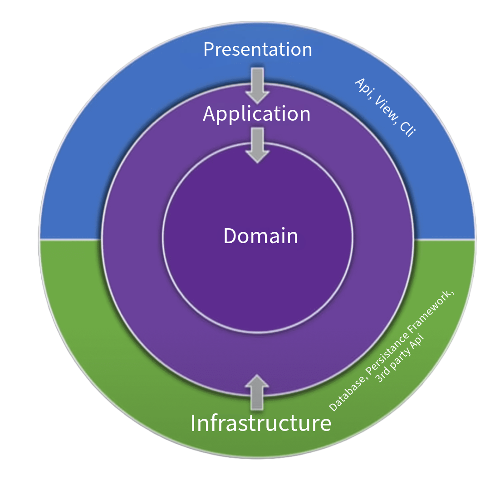
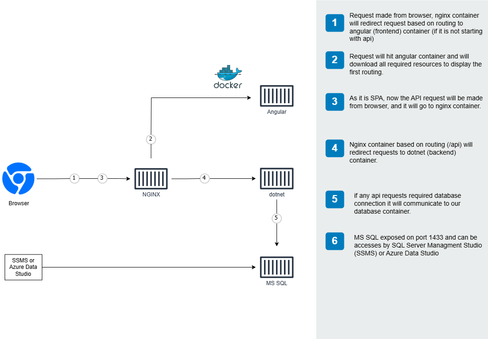

[](https://github.com/nitin27may/clean-architecture-docker-dotnet-angular/actions/workflows/angular-build.yml)
[](https://github.com/nitin27may/clean-architecture-docker-dotnet-angular/actions/workflows/api-build.yml)
# Clean Architecture Full-Stack Starter: .NET, Angular, and MS SQL Server with Docker
## Project Overview
This repository serves as a comprehensive boilerplate for building a full-stack web application using **.NET 9 Web API**, **Angular 19**, and **MS SQL Server** with Docker. It includes built-in features like user registration, authentication with JWT, CRUD operations, and is optimized for both development and production environments.

A startup project template built with **Angular 19** and **ASP.NET Core 9** (cross-platform), featuring a complete implementation of login, user management, and role-based access control. It also includes essential functionalities for rapid application development.

This template is designed for ease of use, customization, and scalability. It adheres to best practices and conventions of both Angular and ASP.NET Core, leveraging modern technologies and tools to ensure an efficient and streamlined workflow.
<hr>

## **Note**
This project is under active development, and we are regularly adding new features, enhancements, and documentation updates. 

- The README will soon include more detailed descriptions and usage guides.
- A series of in-depth articles explaining the architecture, design, and implementation details is also in progress.

Stay tuned and watch this repository for the latest updates!
<hr>

## Clean Architecture Series (Ctrl+Click or Cmd+Click to open in a new tab)

To understand this project in-depth, refer to our detailed series of articles on Clean Architecture. This series explains the architectural decisions, setup processes, and best practices used throughout this project.

1. [Clean Architecture: Introduction to the Project Structure](https://nitinksingh.com/clean-architecture-introduction-to-the-project-structure/) - Overview of architectural layers and their roles
2. [Clean Architecture: Implementing AutoMapper for DTO Mapping with Audit Details](https://nitinksingh.com/implementing-automapper-for-dto-mapping-and-audit-logging/) - Setting up AutoMapper for data transformation and audit trails
3. [Clean Architecture: Validating Inputs with FluentValidation](https://nitinksingh.com/validating-inputs-with-fluent-validation/) - Implementing clean input validation with FluentValidation
4. [Clean Architecture: Dependency Injection Setup Across Layers](https://nitinksingh.com/dependency-injection-setup-across-layers/) - Configuring dependency injection for better modularity
5. [Clean Architecture: Implementing Activity Logging with Custom Attributes](https://nitinksingh.com/implementing-activity-logging-with-custom-attributes/) - Building a custom attribute system for activity tracking
6. [Clean Architecture: Handling Authorization and Role-Based Access Control (RBAC)](https://nitinksingh.com/role-based-access-control-rbac-implementation-in-clean-architecture) - Setting up robust authorization and access control
7. [Clean Architecture: The Unit of Work Pattern and Transaction Management Using Dapper](https://nitinksingh.com/unit-of-work-pattern-and-its-role-in-managing-transactions/) - Implementing reliable transaction management
8. [Clean Architecture: Using Dapper for Data Access with the Repository Pattern](https://nitinksingh.com/using-dapper-for-data-access-and-repository-pattern/) - Implementing efficient data access patterns
9. [Clean Architecture: Best Practices for Creating and Using DTOs in the API](https://nitinksingh.com/best-practices-for-creating-and-using-dtos-in-the-api/) - Designing and implementing effective DTOs
10. [Clean Architecture: Seeding Initial Data Using Docker Compose and SQL Scripts](https://nitinksingh.com/seeding-initial-data-using-docker-compose-and-sql-scripts/) - Setting up automated data seeding
11. [Dockerizing the .NET Core API and MS SQL Server](https://nitinksingh.com/dockerizing-the-net-core-api-and-ms-sql-server/) - Creating a containerized development environment
12. [Error Handling and Exception Management in the API](https://nitinksingh.com/error-handling-and-exception-management-in-the-api/) - Building a robust error handling system

## Features
A complete backend and frontend project structure to build on, with login, user and permission-based role management already integrated
### Core Architecture
- [x] Clean Architecture Design
- [x] Modular Project Structure

### Backend: .NET
- [x] .NET 9
- [x] Dapper Support
- [x] Authentication/Authorization based on OIDC/OAuth2 and ASP.NET Core Identity
- [x] Middleware for Exception Handling
- [x] Role Based API access, Support for Feature and Operation Mapping
- [x] Activity Log (as User's Activity)
- [x] Swagger/OpenAPI Documentation

### Frontend: Angular
- [x] Angular 19
- [x] Bootstrap Integration

### Dockerized Setup
- [x] Docker-Compose for Multi-Container Orchestration with NGINX as Load Balancer
- [ ] Health Checks
- [x] Docker Debug mode with hot reload for the API and UI
- [x] Docker Production version

## Architecture
The project is structured with Clean Architecture principles, separating the solution into distinct layers to ensure scalability, maintainability, and testability. This includes a modular design with API, Application, Domain, and Infrastructure layers.



## Containers


## Quick Start
To quickly start the application, clone the repository and run Docker Compose:

```
  git clone https://github.com/nitin27may/clean-architecture-docker-dotnet-angular.git angular-dotnet
  cd angular-dotnet 
  //rename .env.example to .env 
  docker-compose up
```

**Note** I have used SMTP send function, please update the account details

## Project Folders 
The apps written in the following JavaScript frameworks/libraries:

| folder          | Description                                                                                  |
| --------------- | -------------------------------------------------------------------------------------------- |
| **Frontend (Angular)** | [Angular 19-based front-end application with JWT security.](https://github.com/nitin27may/clean-architecture-docker-dotnet-angular/tree/master/frontend)         |
| **Api (.Net)** | [.NET 9 REST API with Clean Architectuire.](https://github.com/nitin27may/clean-architecture-docker-dotnet-angular/tree/main/backend/src) |

### Built With
#### Angular (19.0.0)

The fronend of this project is developed in Angular. As we are using Server Side Rendering (SSR) we have used Nodejs alpine image in place of other lightweight docker image like nginx to run Angular app.

It contains sample for below (Both UI and API implmentation ):

 1. User Registration
 2. Login
 3. Forgot Password
 4. Change Password
 5. Role based API access 
 6. Profile
 7. A complete CRUD example for Contact

Also, it has sample code for Auth guard, services, http interceptors, resolver and JWT implementation


**[Dockerfile for Production](/frontend/Dockerfile)**
**[Dockerfile for Development](/frontend/debug.dockerfile)**

#### Dotnet (9.0.0)

Rest APis of this project is devloped using dotnet

It contains sample for:

1. Middleware implemetation for logs
2. JWT implementation for Authorization
3. API routing
4. User registration, login, forgot password, reset password
5. Role based api permission
6. Audit Log
7. Fulent Validation
8. Complete CRUD example for Contact


**[Dockerfile for production](/backend/src/Dockerfile)**
**[Dockerfile for development](/backend/src/Debug.Dockerfile)**


## Getting started

### Using Docker

#### Prerequisite
  
  Install latest [Docker Desktop](https://www.docker.com/products/docker-desktop)


#### Data Seed

 We have added a seed file with data, which will be loaded on docker compose, it has 3 users with different role:
 
 | Username             |  Passsword    |  Role    |
 |----------------------|---------------|----------|
 |nitin27may@gmail.com  | P@ssword#321  | Admin    |
 |editor@gmail.com      | P@ssword#321  | Editor   |
 |reader@gmail.com      | P@ssword#321  | Reader   |

## Feature Request
We welcome suggestions and ideas to improve Clean Architecture Docker .NET Angular! If you have a feature you'd like to see, request from [this link](https://github.com/nitin27may/clean-architecture-docker-dotnet-angular/issues/new?assignees=&labels=&projects=&template=feature_request.md&title= ).

## License
This project is licensed under the MIT License. See the [LICENSE file](LICENSE) for details.

## Contact
For support or questions, please contact Nitin Singh at nitin27may@gmail.com.

