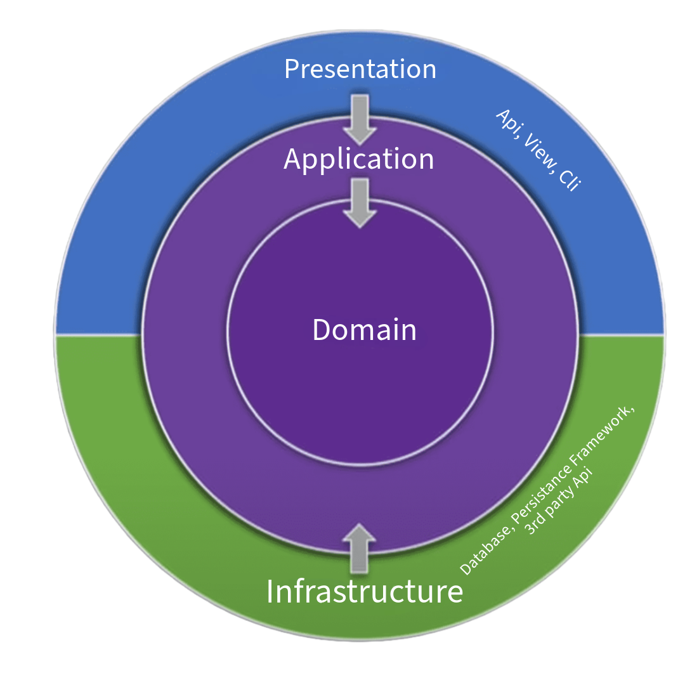
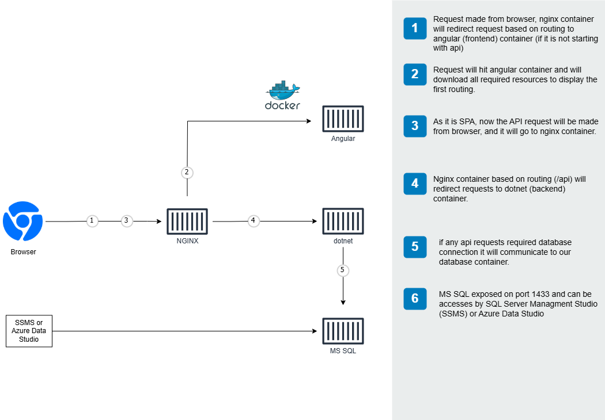

# 🚀 Clean Architecture Full-Stack Starter: .NET, Angular, and PostgreSQL

<!-- <p align="center">
  
  <br>
  <em>Production-ready | Maintainable | Scalable</em>
</p> -->

<p align="center">
  <a href="https://github.com/nitin27may/clean-architecture-docker-dotnet-angular/actions/workflows/angular-build.yml">
    
  </a>
  <a href="https://github.com/nitin27may/clean-architecture-docker-dotnet-angular/actions/workflows/api-build.yml">
    
  </a>
  <a href="LICENSE">
    
  </a>
  
  
  
</p>

<p align="center">
  

  
<em>Contact Management Application with Role-Based Access Control</em>
</p>

## ✨ What is this?

A production-ready **full-stack starter kit** built with modern technologies and best practices:

- **Frontend**: Angular 19 with signals, Material Design, and TailwindCSS
- **Backend**: .NET 9 API with Clean Architecture
- **Database**: PostgreSQL with Dapper
- **DevOps**: Docker, GitHub Actions, NGINX

Perfect for developers who want to **focus on business logic** instead of configuring infrastructure.

## 🏗️ Why Clean Architecture?

<p align="center">
  
</p>

Clean Architecture provides **significant benefits** for your application:

- ✅ **Maintainability**: Separate concerns to make your code easier to understand and modify
- ✅ **Testability**: Independent components that can be tested in isolation
- ✅ **Flexibility**: Swap frameworks or technologies without rewriting your core business logic
- ✅ **Scalability**: Grow your application with a clear structure that new team members can quickly understand

[Clean Architecture Series](./docs/architecture-series.md) - Read more about it!

## 🚀 Quick Start

```bash
# Clone the repository
git clone https://github.com/nitin27may/clean-architecture-docker-dotnet-angular.git clean-app
cd clean-app

# Create .env file (required)
cp .env.example .env

# Start all services with Docker Compose
docker-compose up
```

🔗 Then access:
- Frontend: http://localhost
- API: http://localhost/api
- Swagger: http://localhost/swagger

### 👤 Default Users

| Username | Password | Role |
|----------|----------|------|
| nitin27may@gmail.com | P@ssword#321 | Admin |
| editor@gmail.com | P@ssword#321 | Editor |
| reader@gmail.com | P@ssword#321 | Reader |

## 🔥 Key Features

<table>
  <tr>
    <td width="33%">
      <h3>📱 Modern Frontend</h3>
      <ul>
        <li>Angular 19 with standalone components</li>
        <li>Signal-based state management</li>
        <li>Material Design + TailwindCSS</li>
        <li>Dark/light theme support</li>
        <li>Responsive mobile-first design</li>
         <li>Role Based Routing and Menu</li>
      </ul>
    </td>
    <td width="33%">
      <h3>🔒 Secure Backend</h3>
      <ul>
        <li>Clean Architecture implementation</li>
        <li>Generic Repository pattern</li>
        <li>JWT authentication</li>
        <li>Role-based permissions</li>
        <li>User Activity Logging</li>
        <li>Golbal Exception Handling</li>
        <li>PostgreSQL with Dapper</li>
      </ul>
    </td>
    <td width="33%">
      <h3>🚢 DevOps Ready</h3>
      <ul>
        <li>Docker containerization</li>
        <li>GitHub Actions workflows</li>
        <li>NGINX reverse proxy</li>
        <li>Multi-environment configs</li>
        <li>Database migrations</li>
      </ul>
    </td>
  </tr>
</table>

## 🧩 Architecture

<p align="center">
  
  <br>
  <em>Container Architecture Overview</em>
</p>

## 📚 Documentation

📖 Comprehensive documentation is available:

- [Development Guide](./docs/development-guide.md) - Get started with development
- [Frontend Documentation](./docs/frontend.md) - Angular architecture details
- [Backend Documentation](./docs/backend.md) - .NET API implementation
- [Feature List](./docs/visual-feature-guide.md) - Detailed feature breakdown
- [Clean Architecture Series](./docs/architecture-series.md) - In-depth articles
- [Roadmap](./docs/roadmap.md) - Upcoming features


## 🤝 Contributing

We welcome contributions! See our [contributing guide](./CONTRIBUTING.md) for details on how to get involved.

## 📄 License

This project is licensed under the MIT License - see the [LICENSE](LICENSE) file for details.

## 📧 Contact

For questions or support, please contact Nitin Singh at nitin27may@gmail.com.

## 🌟 Star the Repository

If you find this project useful, please consider giving it a star on GitHub to show your support!