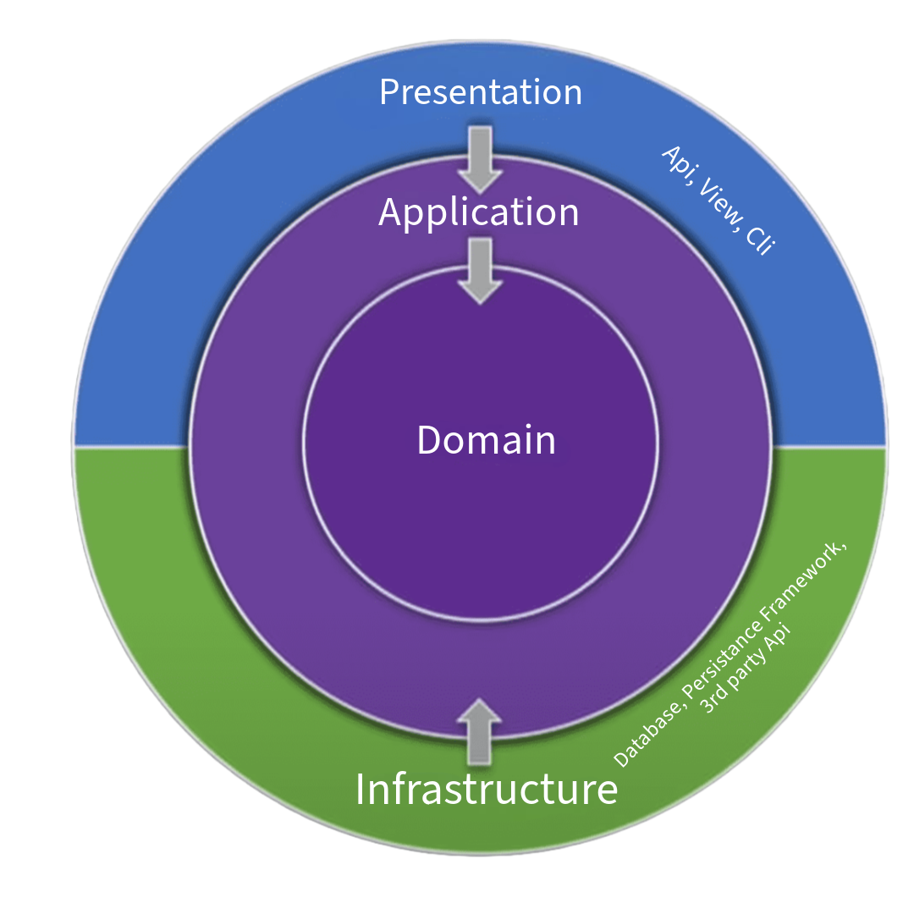
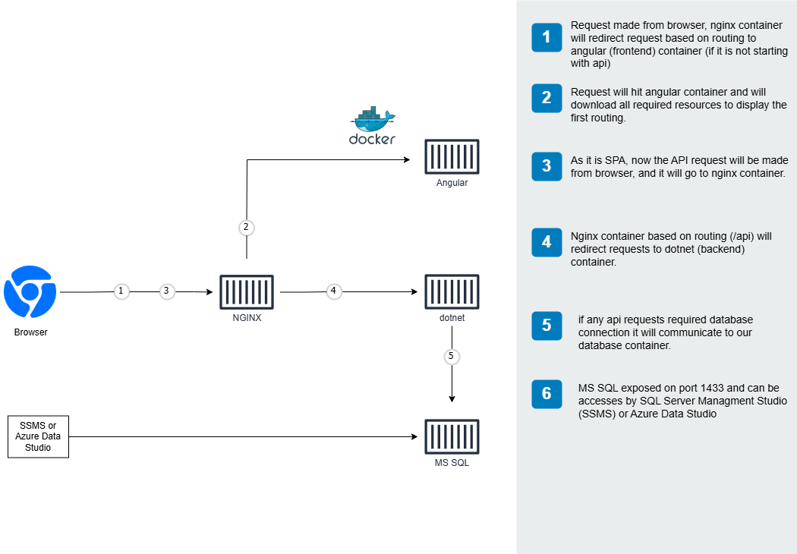

# Clean Architecture Full-Stack Starter: .NET, Angular, and PostgreSQL
> Clean Architecture with RBAC implementation for API (.Net) and UI (Angular)
<p align="center">
  <a href="https://github.com/nitin27may/clean-architecture-docker-dotnet-angular/actions/workflows/angular-build.yml">
    
  </a>
  <a href="https://github.com/nitin27may/clean-architecture-docker-dotnet-angular/actions/workflows/api-build.yml">
    
  </a>
  <a href="LICENSE">
    
  </a>
  
  
  
  
</p>

<p align="center">
  

  
<em>Contact Management Application with Role-Based Access Control</em>
</p>

## What is this?

A production-ready **full-stack starter kit** built with modern technologies and best practices:

- **Frontend**: Angular 21 with signals, Material Design, TailwindCSS v4, and Fluent Design
- **Backend**: .NET 10 API with Clean Architecture and Scalar API documentation
- **Database**: PostgreSQL 17 with pgAdmin and Dapper ORM
- **Orchestration**: .NET Aspire 9.5 for local development with service discovery
- **DevOps**: Docker, GitHub Actions, NGINX

Perfect for developers who want to **focus on business logic** instead of configuring infrastructure.

> **License policy:** this repo is MIT and is meant to be forked into your own project, so
> every dependency here stays under a permissive license (MIT/Apache 2.0) with no commercial
> tier or reciprocal obligation attached. When a library the project used moved to a dual
> license — AutoMapper's shift to RPL-1.5/commercial in mid-2025 — it was replaced rather than
> pinned or paid for. See [ADR 0001](docs/adr/0001-permissive-license-dependency-policy.md)
> for the reasoning.

## Why Clean Architecture?

<p align="center">
  
</p>

Clean Architecture provides **significant benefits** for your application:

- ✅ **Maintainability**: Separate concerns to make your code easier to understand and modify
- ✅ **Testability**: Independent components that can be tested in isolation
- ✅ **Flexibility**: Swap frameworks or technologies without rewriting your core business logic
- ✅ **Scalability**: Grow your application with a clear structure that new team members can quickly understand

[Clean Architecture Series](./docs/architecture-series.md) - Read more about it!

## Quick Start

### Option 1: Using .NET Aspire (Recommended for Development)

**.NET Aspire** provides a streamlined local development experience with automatic service discovery, health monitoring, and an integrated dashboard.

#### Prerequisites

> **Important**: Make sure you have the correct versions installed before proceeding.

- [.NET SDK 10.0](https://dotnet.microsoft.com/download/dotnet/10.0) or later
- [Node.js 22 LTS](https://nodejs.org/) (**not** Node 23 - use LTS version only)
- [Docker Desktop](https://www.docker.com/products/docker-desktop) (for PostgreSQL container)

#### Steps

```bash
# Clone the repository
git clone https://github.com/nitin27may/clean-architecture-docker-dotnet-angular.git clean-app
cd clean-app

# IMPORTANT: Install Angular dependencies first
cd frontend
npm install
cd ..

# Run with Aspire
dotnet run --project aspire/AppHost
```

🔗 Then access:
- **Aspire Dashboard**: https://localhost:17178 (see all services, logs, traces)
- **Frontend**: http://localhost:4200
- **API**: Check Aspire dashboard for the assigned port
- **Scalar API Docs**: `{API_URL}/scalar/v1`
- **pgAdmin**: Check Aspire dashboard for the assigned port

### Option 2: Using Pre-built Images (Fastest)

Run the application instantly using pre-built images from GitHub Container Registry - **no build required**:

```bash
# Clone the repository
git clone https://github.com/nitin27may/clean-architecture-docker-dotnet-angular.git clean-app
cd clean-app

# Create .env file (required)
cp .env.example .env

# Run with pre-built images from GHCR
docker compose -f docker-compose.ghcr.yml up -d
```

> 💡 **Tip**: Use `docker compose -f docker-compose.ghcr.yml pull` to fetch the latest images before starting.

### Option 3: Using Docker Compose (Build Locally)

Build and run all services locally:

```bash
# Clone the repository
git clone https://github.com/nitin27may/clean-architecture-docker-dotnet-angular.git clean-app
cd clean-app

# Create .env file (required)
cp .env.example .env

# Build and start all services
docker-compose up --build
```

🔗 Then access (for both Option 2 & 3):
- Frontend: http://localhost
- API: http://localhost/api
- Scalar API Docs: http://localhost/scalar/v1
- pgAdmin: http://localhost:5050

### 👤 Default Users

| Username | Password | Role |
|----------|----------|------|
| nitin27may@gmail.com | P@ssword#321 | Admin |
| editor@gmail.com | P@ssword#321 | Editor |
| reader@gmail.com | P@ssword#321 | Reader |

## Key Features

<table>
  <tr>
    <td width="33%">
      <h3>Modern Frontend</h3>
      <ul>
        <li>Angular 21 with standalone components</li>
        <li>Signal-based state management</li>
        <li>Material Design + TailwindCSS v4</li>
        <li>Fluent Design System tokens</li>
        <li>Dark/light theme support</li>
        <li>Responsive mobile-first design</li>
        <li>Role-based routing and menu</li>
      </ul>
    </td>
    <td width="33%">
      <h3>Secure Backend</h3>
      <ul>
        <li>Clean Architecture implementation</li>
        <li>Generic Repository pattern</li>
        <li>JWT authentication</li>
        <li>Role-based permissions</li>
        <li>User activity logging</li>
        <li>Global exception handling</li>
        <li>Scalar API documentation</li>
        <li>PostgreSQL 17 with Dapper</li>
      </ul>
    </td>
    <td width="33%">
      <h3>DevOps Ready</h3>
      <ul>
        <li>.NET Aspire orchestration</li>
        <li>Docker containerization</li>
        <li>GitHub Actions workflows</li>
        <li>NGINX reverse proxy</li>
        <li>pgAdmin database management</li>
        <li>Multi-environment configs</li>
        <li>Database seeding</li>
      </ul>
    </td>
  </tr>
</table>

## Project Structure

```
clean-architecture-docker-dotnet-angular/
├── aspire/                      # .NET Aspire orchestration
│   ├── AppHost/                 # Aspire host application
│   │   └── AppHost.cs           # Service configuration
│   └── ServiceDefaults/         # Shared Aspire defaults
├── backend/                     # .NET 10 API (Clean Architecture)
│   ├── Contact.Api/             # API Layer (Controllers, Middleware)
│   ├── Contact.Application/     # Application Layer (Services, DTOs)
│   ├── Contact.Domain/          # Domain Layer (Entities, Interfaces)
│   ├── Contact.Infrastructure/  # Infrastructure Layer (Repositories)
│   └── Contact.Common/          # Shared utilities
├── frontend/                    # Angular 21 SPA
│   ├── src/app/@core/           # Core module (guards, interceptors, layout)
│   ├── src/app/feature/         # Feature modules (contact, user, admin)
│   └── src/app/styles/          # Global styles, Tailwind config
├── scripts/                     # Database initialization
│   ├── 01-init-db.sh            # Create database
│   └── 02-seed-data.sql         # Seed initial data
├── api-collection/              # Bruno API collection for testing
├── docs/                        # Documentation
├── loadbalancer/                # NGINX configuration
├── Contact.Api.sln              # .NET Solution file
├── docker-compose.yml           # Docker Compose (build locally)
├── docker-compose.ghcr.yml      # Docker Compose (pre-built GHCR images)
└── Dockerfile.api               # API Dockerfile
```

## Architecture

<p align="center">
  
  <br>
  <em>Container Architecture Overview</em>
</p>

## Documentation

Comprehensive documentation is available:

- [Aspire Guide](./docs/aspire-guide.md) - Running with .NET Aspire
- [Development Guide](./docs/development-guide.md) - Get started with development
- [Frontend Documentation](./docs/frontend.md) - Angular architecture details
- [Backend Documentation](./docs/backend.md) - .NET API implementation
- [Docker Guide](./docs/docker-guide.md) - Container configuration
- [Feature List](./docs/visual-feature-guide.md) - Detailed feature breakdown
- [Clean Architecture Series](./docs/architecture-series.md) - In-depth articles
- [Roadmap](./docs/roadmap.md) - Upcoming features

## Technology Stack

| Layer | Technology | Version |
|-------|------------|---------|
| Frontend | Angular | 21.0 |
| UI Components | Angular Material | 21.0 |
| CSS Framework | TailwindCSS | 4.1 |
| Backend | .NET | 10.0 |
| API Docs | Scalar | 2.1 |
| Database | PostgreSQL | 17 |
| ORM | Dapper | 2.1 |
| Orchestration | .NET Aspire | 9.5 |
| Containerization | Docker | Latest |

## 🤝 Contributing

We welcome contributions! See our [contributing guide](./CONTRIBUTING.md) for details on how to get involved.

## License

This project is licensed under the MIT License - see the [LICENSE](LICENSE) file for details.

## Contact

For questions or support, please contact Nitin Singh at nitin27may@gmail.com.

## Star the Repository

If you find this project useful, please consider giving it a star on GitHub to show your support!
