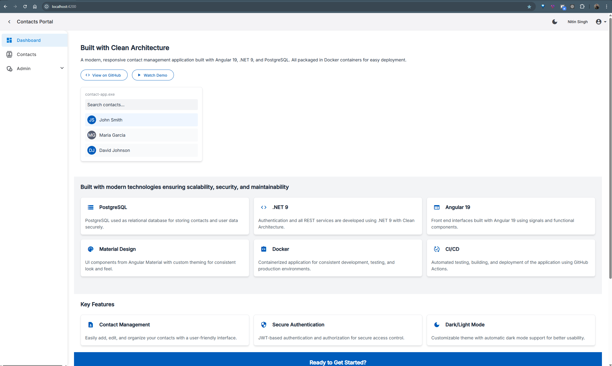
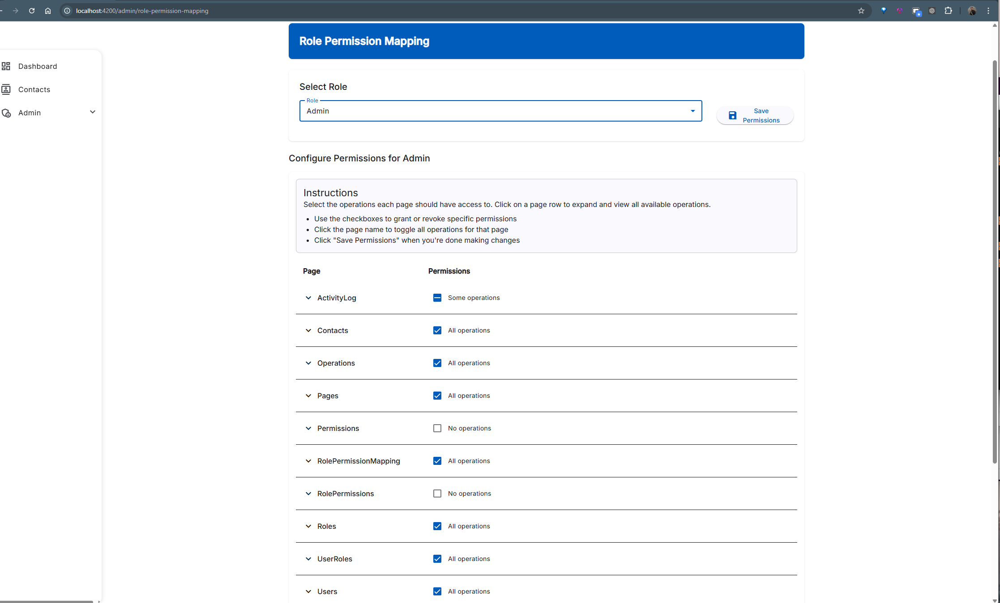
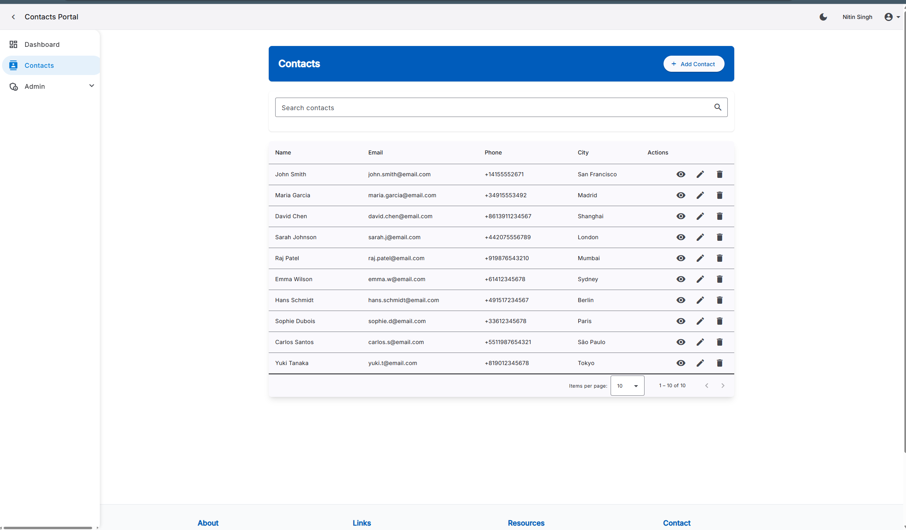
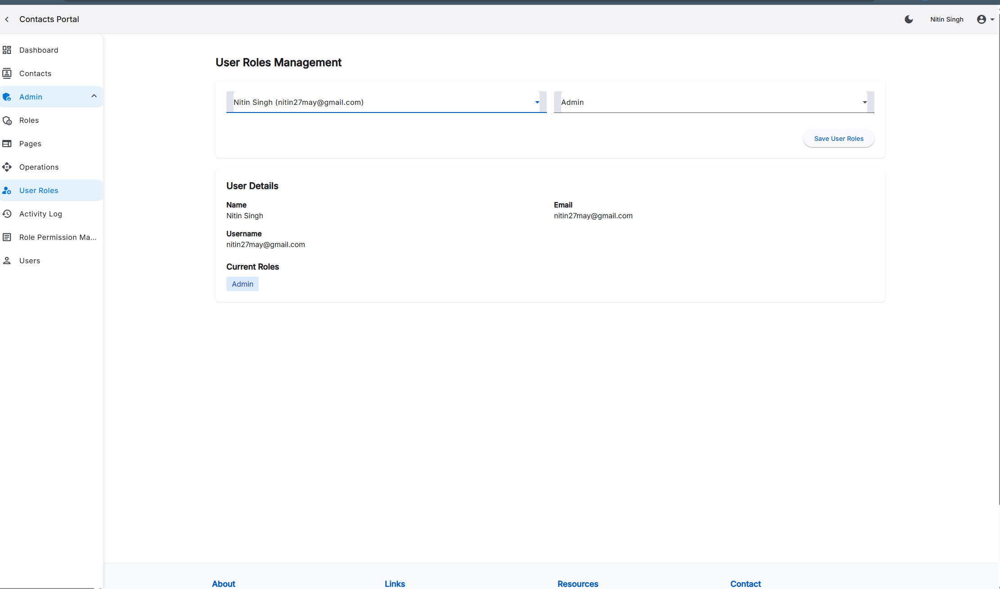
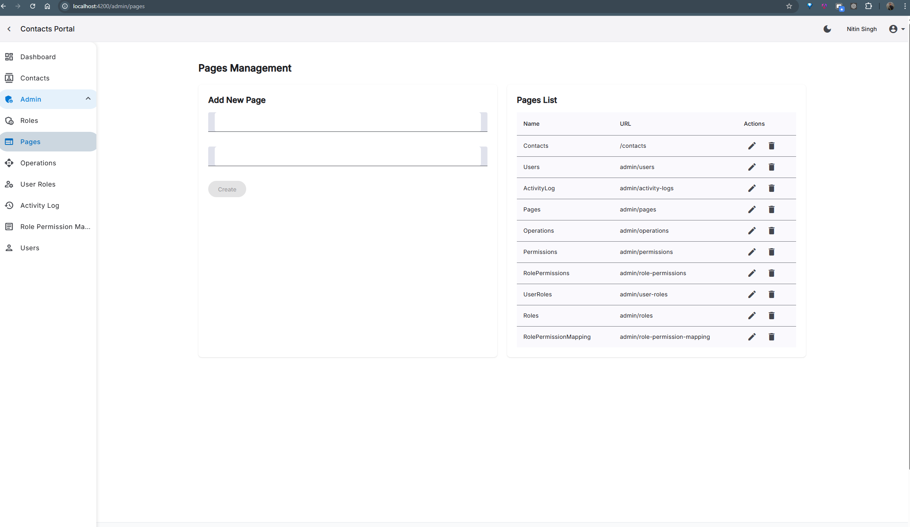
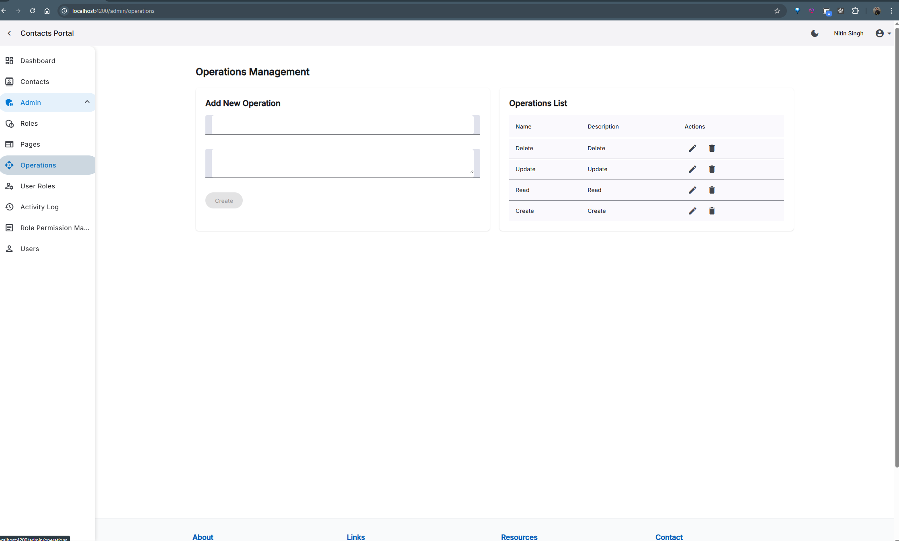

# Feature Showcase

This document provides a visual overview of the key features implemented in the Clean Architecture Full-Stack starter.

## Landing Page

### 🏠 Welcome Dashboard

The application features a modern, responsive landing page that welcomes users and provides easy access to key features. The landing page includes:

- Clean, intuitive user interface with Material Design components
- Dynamic welcome message based on user role and permissions
- Quick access cards to frequently used features
- Responsive layout that adapts to various screen sizes
- Theme-aware design with full light and dark mode support

  
  
Light Mode Landing Page with Material Design components

### 🌙 Dark Mode Experience

The landing page fully supports dark mode, providing users with a comfortable viewing experience in low-light environments. The dark theme:

- Automatically detects system preferences for theme selection
- Allows manual toggle between light and dark modes
- Preserves user theme preference between sessions
- Maintains excellent contrast and readability
- Uses consistent color palette across all UI elements

  
  
Dark Mode Landing Page showing theme adaptability

## Authentication & Authorization

### 🔐 Secure Login

Our authentication system implements industry-standard security practices with JWT token-based authentication. Users experience a clean, intuitive login interface with proper validation feedback. The system includes:

- Secure password storage with bcrypt hashing
- JWT token with configurable expiration
- Remember me functionality
- Form validation with immediate feedback

  
  
Login screen with form validation and security features

### 🛡️ Role-Based Access

Our comprehensive role-based permission system ensures users can only access features appropriate to their role. The system implements:

- Three distinct role levels: Admin, Editor, and Reader
- Granular UI permissions that dynamically adjust the interface
- Route guards that prevent unauthorized access
- API-level authorization checks
- Permission-based action buttons that only appear for authorized users

  
  
Role-Permission mapping interface for fine-grained access control

## Modern UI Components

### 🌙 Dark Mode Support

Our application provides a fully implemented dark mode that respects user preferences and enhances accessibility. The theming system includes:

- System preference detection for automatic theme selection
- User preference persistence between sessions
- Smooth transition animations between themes
- Consistent color palette across all components
- Material Design theming integration with TailwindCSS

  
  
Dark mode implementation enhancing accessibility and user comfort

### 📱 Responsive Design

Our application is built with a mobile-first approach, ensuring an optimal experience across all devices. The responsive system features:

- Adaptive layouts that adjust to screen size
- Touch-friendly controls for mobile users
- Collapsible navigation for small screens
- Responsive data tables with horizontal scrolling
- Optimized form layouts for different screen sizes
- TailwindCSS utilities for consistent breakpoints

  
  
Responsive design adapting to different screen sizes

## Contact Management

### 📋 Contact List

The contact management system provides a powerful, feature-rich interface for working with contact data. The list view includes:

- Multi-column sorting capabilities
- Advanced filtering with multiple criteria
- Quick search functionality
- Bulk actions for efficient management
- Responsive design that works on all devices
- Role-based action buttons

  
  
Contact list view with sorting, filtering, and search capabilities

### ✏️ Contact Form

The contact form provides an intuitive interface for creating and editing contact information with comprehensive validation. Features include:

- Real-time validation feedback
- Custom validation rules for emails, phone numbers, etc.
- Conditional form fields based on selection
- Modern Material Design inputs with TailwindCSS styling

  
  
Contact form with real-time validation feedback

## User Management

### 👤 User Management

The comprehensive user management system allows administrators to create, edit, and manage user accounts. Features include:

- User listing with search and filter capabilities
- User role assignment
- Account status management (active/inactive)
- User detail view with complete information

  
  
User management interface for administrators

### 🔄 User Role Mapping

Our role management system provides an easy interface for assigning roles to users and managing permissions. The system includes:

- Visual role assignment interface
- Role-based permission inheritance
- Bulk role operations
- Audit logging of role changes

  
  
User role mapping interface for role assignment

## System Administration

### 📄 Page Management

The page management module allows administrators to control access to different areas of the application:

- Page registration and management
- Page visibility control
- Integration with permission system
- Hierarchical page organization

  
  
Page management interface for controlling application sections

### ⚙️ Operation Management

The operation management system provides granular control over specific actions within the application:

- Operation registration and configuration
- Permission assignment for operations
- API endpoint security mapping
- UI action integration

  
  
Operation management for controlling user actions

### 👑 Role Management

The role management module allows administrators to define custom roles with specific permissions:

- Role creation and editing
- Permission assignment to roles
- Role hierarchy management
- Default role configuration

  
  
Role management interface for permission control

### 📝 User Activity Logging

The activity logging system provides a comprehensive audit trail of user actions throughout the application:

- Detailed activity records with timestamps
- User identification and session tracking
- Action categorization and filtering
- Security event highlighting

  
  
Activity logging system for audit trail and security

## Clean Architecture Implementation

### 🏛️ Backend Architecture

Our backend strictly follows Clean Architecture principles, providing a maintainable and testable codebase. Key architectural features include:

- Clear separation of Domain, Application, Infrastructure, and Presentation layers
- Domain-driven design with rich domain models
- Dependency inversion throughout the codebase
- Generic repository pattern for data access
- Comprehensive validation pipeline
- Structured exception handling with meaningful responses
- Proper separation of cross-cutting concerns

  
  
Clean Architecture implementation with clear separation of concerns

### 🔄 Frontend Architecture

Our Angular implementation leverages the latest features for optimal performance and maintainability. The frontend architecture includes:

- Standalone components for improved modularity
- Signal-based state management for reactive UIs
- Modern dependency injection with the inject() function
- Lazy-loaded feature modules to reduce initial load time
- Comprehensive routing with route guards
- HTTP interceptors for authentication and error handling
- Component-based design with clear responsibilities
- Shared UI component library for consistency

  
  
Frontend architecture showing component organization and data flow

## DevOps & Infrastructure

### 🐳 Docker Integration

Our application is fully containerized using Docker, providing a consistent environment across development and production. The Docker setup includes:

- Multi-stage builds for optimized production images
- Docker Compose configurations for different environments
- Volume mounting for development workflow
- Proper network configuration for service communication
- Environment variable management
- Optimized caching for faster builds
- Container orchestration ready configuration

*See our complete [Docker Guide]({{ '/docker-guide/' | relative_url }}) for full details on the containerization approach.*

### 📊 API Documentation

Our API is thoroughly documented using Swagger/OpenAPI, making it easy for developers to understand and use. The documentation features:

- Interactive API explorer with try-it-now functionality
- Detailed request and response schemas
- Authentication requirements for each endpoint
- Comprehensive examples for common operations
- Error response documentation
- Performance expectations and rate limiting details
- Downloadable OpenAPI specification

*Available at `/swagger` endpoint when running the application.*

## Additional Features

### ✅ Form Validation

- Client-side validation with reactive forms
- Server-side validation with FluentValidation
- Error messages and visual feedback
- Cross-field validation rules
- Asynchronous validation (e.g., username availability)
- Custom validators for complex business rules
- Validation summary for form-wide errors

### 📝 Activity Logging

- Comprehensive audit trail of user actions
- Structured logging with contextual information
- User session tracking with IP and device info
- Security event monitoring and alerting
- Log filtering and search capabilities
- Performance impact monitoring

### 🔔 Notification System

- Toast notifications for user feedback
- Success/error/warning message types
- Configurable display duration
- Notification stacking for multiple messages
- Position customization (top, bottom, etc.)
- Progress indicators for long-running operations
- Notification history and management

### 🌐 Internationalization

- Support for multiple languages using i18n
- Localization of dates, numbers, and currencies
- Language selection persistence
- Automatic language detection
- Dynamic content translation

## Live Demo

  
  
A demonstration of the key features and workflows in the application

## Coming Soon Features

For upcoming features, please refer to our [roadmap document]({{ '/roadmap/' | relative_url }}), which includes:

- Enhanced RBAC & UI Modernization
- Application Logs & Monitoring
- Real-Time Notifications
- Social Media Login
- Mobile Application

---

*Note: For more detailed technical information on implementing features, see our [Development Guide]({{ '/development-guide/' | relative_url }}).*