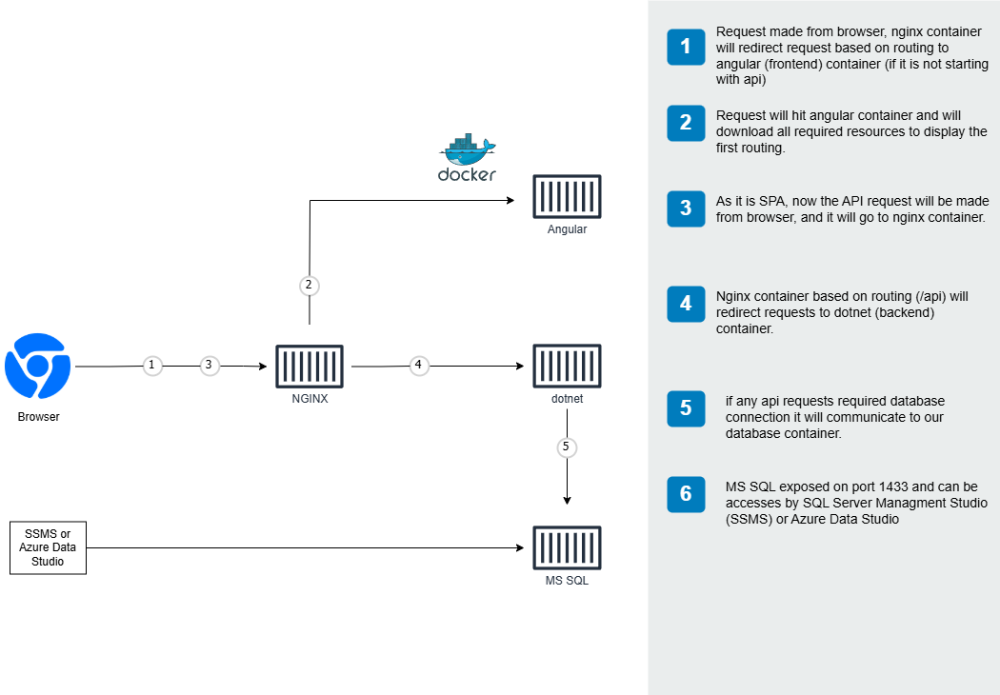

# Feature Showcase

This document provides a visual overview of the key features implemented in the Clean Architecture Full-Stack starter.

## Landing Page

  <h3>🏠 Welcome Dashboard</h3>
  
The application features a modern, responsive landing page that welcomes users and provides easy access to key features. The landing page includes:

  <ul style="text-align: left; display: inline-block; margin-bottom: 20px;">
    <li>Clean, intuitive user interface with Material Design components</li>
    <li>Dynamic welcome message based on user role and permissions</li>
    <li>Quick access cards to frequently used features</li>
    <li>Responsive layout that adapts to various screen sizes</li>
    <li>Theme-aware design with full light and dark mode support</li>
  </ul>
  

  <h3>🌙 Dark Mode Experience</h3>
  
The landing page fully supports dark mode, providing users with a comfortable viewing experience in low-light environments. The dark theme:

  <ul style="text-align: left; display: inline-block; margin-bottom: 20px;">
    <li>Automatically detects system preferences for theme selection</li>
    <li>Allows manual toggle between light and dark modes</li>
    <li>Preserves user theme preference between sessions</li>
    <li>Maintains excellent contrast and readability</li>
    <li>Uses consistent color palette across all UI elements</li>
  </ul>
  

## Authentication & Authorization

  <h3>🔐 Secure Login</h3>
  
Our authentication system implements industry-standard security practices with JWT token-based authentication. Users experience a clean, intuitive login interface with proper validation feedback. The system includes:

  <ul style="text-align: left; display: inline-block; margin-bottom: 20px;">
    <li>Secure password storage with bcrypt hashing</li>
    <li>JWT token with configurable expiration</li>
    <li>Remember me functionality</li>
    <li>Form validation with immediate feedback</li>
  </ul>
  

  <h3>🛡️ Role-Based Access</h3>
  
Our comprehensive role-based permission system ensures users can only access features appropriate to their role. The system implements:

  <ul style="text-align: left; display: inline-block; margin-bottom: 20px;">
    <li>Three distinct role levels: Admin, Editor, and Reader</li>
    <li>Granular UI permissions that dynamically adjust the interface</li>
    <li>Route guards that prevent unauthorized access</li>
    <li>API-level authorization checks</li>
    <li>Permission-based action buttons that only appear for authorized users</li>
  </ul>
  

## Modern UI Components

  <h3>🌙 Dark Mode Support</h3>
  
Our application provides a fully implemented dark mode that respects user preferences and enhances accessibility. The theming system includes:

  <ul style="text-align: left; display: inline-block; margin-bottom: 20px;">
    <li>System preference detection for automatic theme selection</li>
    <li>User preference persistence between sessions</li>
    <li>Smooth transition animations between themes</li>
    <li>Consistent color palette across all components</li>
    <li>Material Design theming integration with TailwindCSS</li>
  </ul>
  

  <h3>📱 Responsive Design</h3>
  
Our application is built with a mobile-first approach, ensuring an optimal experience across all devices. The responsive system features:

  <ul style="text-align: left; display: inline-block; margin-bottom: 20px;">
    <li>Adaptive layouts that adjust to screen size</li>
    <li>Touch-friendly controls for mobile users</li>
    <li>Collapsible navigation for small screens</li>
    <li>Responsive data tables with horizontal scrolling</li>
    <li>Optimized form layouts for different screen sizes</li>
    <li>TailwindCSS utilities for consistent breakpoints</li>
  </ul>
  

## Contact Management

  <h3>📋 Contact List</h3>
  
The contact management system provides a powerful, feature-rich interface for working with contact data. The list view includes:

  <ul style="text-align: left; display: inline-block; margin-bottom: 20px;">
    <li>Multi-column sorting capabilities</li>
    <li>Advanced filtering with multiple criteria</li>
    <li>Quick search functionality</li>
    <li>Bulk actions for efficient management</li>
    <li>Responsive design that works on all devices</li>
    <li>Role-based action buttons</li>
  </ul>
  

  <h3>✏️ Contact Form</h3>
  
The contact form provides an intuitive interface for creating and editing contact information with comprehensive validation. Features include:

  <ul style="text-align: left; display: inline-block; margin-bottom: 20px;">
    <li>Real-time validation feedback</li>
    <li>Custom validation rules for emails, phone numbers, etc.</li>
    <li>Conditional form fields based on selection</li>
    <li>Modern Material Design inputs with TailwindCSS styling</li>
  </ul>
  

## User Management

  <h3>👤 User Management</h3>
  
The comprehensive user management system allows administrators to create, edit, and manage user accounts. Features include:

  <ul style="text-align: left; display: inline-block; margin-bottom: 20px;">
    <li>User listing with search and filter capabilities</li>
    <li>User role assignment</li>
    <li>Account status management (active/inactive)</li>
    <li>User detail view with complete information</li>
  </ul>
  

  <h3>🔄 User Role Mapping</h3>
  
Our role management system provides an easy interface for assigning roles to users and managing permissions. The system includes:

  <ul style="text-align: left; display: inline-block; margin-bottom: 20px;">
    <li>Visual role assignment interface</li>
    <li>Role-based permission inheritance</li>
    <li>Bulk role operations</li>
    <li>Audit logging of role changes</li>
  </ul>
  

## System Administration

  <h3>📄 Page Management</h3>
  
The page management module allows administrators to control access to different areas of the application:

  <ul style="text-align: left; display: inline-block; margin-bottom: 20px;">
    <li>Page registration and management</li>
    <li>Page visibility control</li>
    <li>Integration with permission system</li>
    <li>Hierarchical page organization</li>
  </ul>
  

  <h3>⚙️ Operation Management</h3>
  
The operation management system provides granular control over specific actions within the application:

  <ul style="text-align: left; display: inline-block; margin-bottom: 20px;">
    <li>Operation registration and configuration</li>
    <li>Permission assignment for operations</li>
    <li>API endpoint security mapping</li>
    <li>UI action integration</li>
  </ul>
  

  <h3>👑 Role Management</h3>
  
The role management module allows administrators to define custom roles with specific permissions:

  <ul style="text-align: left; display: inline-block; margin-bottom: 20px;">
    <li>Role creation and editing</li>
    <li>Permission assignment to roles</li>
    <li>Role hierarchy management</li>
    <li>Default role configuration</li>
  </ul>
  

  <h3>📝 User Activity Logging</h3>
  
The activity logging system provides a comprehensive audit trail of user actions throughout the application:

  <ul style="text-align: left; display: inline-block; margin-bottom: 20px;">
    <li>Detailed activity records with timestamps</li>
    <li>User identification and session tracking</li>
    <li>Action categorization and filtering</li>
    <li>Security event highlighting</li>
  </ul>
  

## Clean Architecture Implementation

  <h3>🏛️ Backend Architecture</h3>
  
Our backend strictly follows Clean Architecture principles, providing a maintainable and testable codebase. Key architectural features include:

  <ul style="text-align: left; display: inline-block; margin-bottom: 20px;">
    <li>Clear separation of Domain, Application, Infrastructure, and Presentation layers</li>
    <li>Domain-driven design with rich domain models</li>
    <li>Dependency inversion throughout the codebase</li>
    <li>Generic repository pattern for data access</li>
    <li>Comprehensive validation pipeline</li>
    <li>Structured exception handling with meaningful responses</li>
    <li>Proper separation of cross-cutting concerns</li>
  </ul>
  

  <h3>🔄 Frontend Architecture</h3>
  
Our Angular implementation leverages the latest features for optimal performance and maintainability. The frontend architecture includes:

  <ul style="text-align: left; display: inline-block; margin-bottom: 20px;">
    <li>Standalone components for improved modularity</li>
    <li>Signal-based state management for reactive UIs</li>
    <li>Modern dependency injection with the inject() function</li>
    <li>Lazy-loaded feature modules to reduce initial load time</li>
    <li>Comprehensive routing with route guards</li>
    <li>HTTP interceptors for authentication and error handling</li>
    <li>Component-based design with clear responsibilities</li>
    <li>Shared UI component library for consistency</li>
  </ul>
  

## DevOps & Infrastructure

  <h3>🐳 Docker Integration</h3>
  
Our application is fully containerized using Docker, providing a consistent environment across development and production. The Docker setup includes:

  <ul style="text-align: left; display: inline-block; margin-bottom: 20px;">
    <li>Multi-stage builds for optimized production images</li>
    <li>Docker Compose configurations for different environments</li>
    <li>Volume mounting for development workflow</li>
    <li>Proper network configuration for service communication</li>
    <li>Environment variable management</li>
    <li>Optimized caching for faster builds</li>
    <li>Container orchestration ready configuration</li>
  </ul>
  
<em>See our complete <a href="{{ '/docker-guide/' | relative_url }}">Docker Guide</a> for full details on the containerization approach.</em>

  <h3>📊 API Documentation</h3>
  
Our API is thoroughly documented using Swagger/OpenAPI, making it easy for developers to understand and use. The documentation features:

  <ul style="text-align: left; display: inline-block; margin-bottom: 20px;">
    <li>Interactive API explorer with try-it-now functionality</li>
    <li>Detailed request and response schemas</li>
    <li>Authentication requirements for each endpoint</li>
    <li>Comprehensive examples for common operations</li>
    <li>Error response documentation</li>
    <li>Performance expectations and rate limiting details</li>
    <li>Downloadable OpenAPI specification</li>
  </ul>
  
<em>Available at <code>/swagger</code> endpoint when running the application.</em>

## Additional Features

### ✅ Form Validation

- Client-side validation with reactive forms
- Server-side validation with FluentValidation
- Error messages and visual feedback
- Cross-field validation rules
- Asynchronous validation (e.g., username availability)
- Custom validators for complex business rules
- Validation summary for form-wide errors

### 📝 Activity Logging

- Comprehensive audit trail of user actions
- Structured logging with contextual information
- User session tracking with IP and device info
- Security event monitoring and alerting
- Log filtering and search capabilities
- Performance impact monitoring

### 🔔 Notification System

- Toast notifications for user feedback
- Success/error/warning message types
- Configurable display duration
- Notification stacking for multiple messages
- Position customization (top, bottom, etc.)
- Progress indicators for long-running operations
- Notification history and management

### 🌐 Internationalization

- Support for multiple languages using i18n
- Localization of dates, numbers, and currencies
- Language selection persistence
- Automatic language detection
- Dynamic content translation

## Live Demo

  
  
A demonstration of the key features and workflows in the application.

## Coming Soon Features

For upcoming features, please refer to our [roadmap document]({{ '/roadmap/' | relative_url }}), which includes:

- Enhanced RBAC & UI Modernization
- Application Logs & Monitoring
- Real-Time Notifications
- Social Media Login
- Mobile Application

---

*Note: For more detailed technical information on implementing features, see our [Development Guide]({{ '/development-guide/' | relative_url }}).*